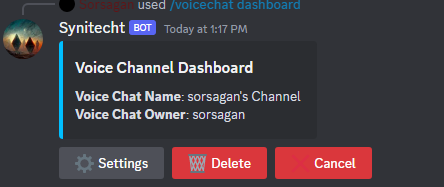
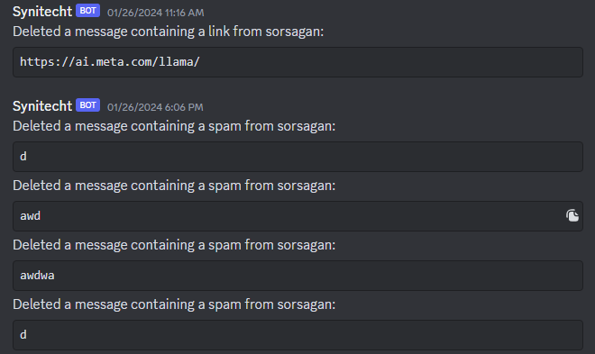
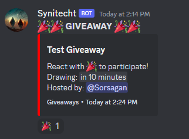
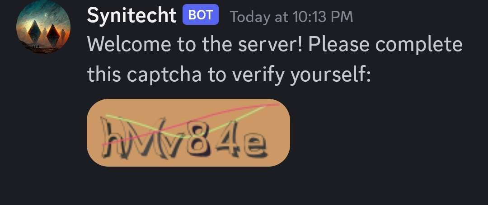

<p align="center">
  <a href="https://github.com/Sorsagan/synitecht" target="blank"></a>
</p>

  <p align="center">Multi-functional <a href="https://discord.js.org" target="_blank">Discord.js</a> based disdcord bot.</p>
    <p align="center">
<a href="https://github.com/Sorsagan/synitecht/releases" target="_blank"></a>
<a href="https://github.com/Sorsagan/synitecht/releases" target="_blank"></a>
<a href="https://discord.gg/Crds8Skmef" target="_blank"></a>
<a href="https://github.com/Sorsagan/synitecht" target="_blank"></a>
<a href="https://www.codefactor.io/repository/github/sorsagan/synitecht" target="_blank"></a>
<a href="https://www.buymeacoffee.com/sorsagan" target="_blank"></a>
</p>

## Description

Synitecht is a powerful Discord bot built using Discord.js v14, designed to enhance your server experience with a variety of features. Whether you're managing a community, gaming server, or a support hub, Synitecht has you covered with its versatile capabilities.


## Contributing

Contributions are always welcome!

For major changes, please open an issue first to discuss what you would like to change.

Please make sure to update tests.

## Key Features:

**Ticket System:**

- Create and manage support tickets seamlessly.
- Provide a structured way for users to seek assistance.

**Temporary Voice Channel System:**

- Dynamically create temporary voice channels on demand.
- Automatically delete channels when not in use.

**Rich Command System:**

- Enjoy a wide range of commands for moderation, utilities, and fun.
- Easily configurable to suit your server's needs.

**Customization:**

- Tailor Synitecht to your server's unique requirements.
- Adjust settings, prefixes, and permissions to fit your community.

**User-Friendly Interface:**

- Intuitive commands for users and administrators alike.
- Clear and concise responses for better user interaction.

## Installation

- Follow these steps to get started with the project.

**Prerequisites**
Make sure you have the following installed:

    Node.js (version 18.7.0 or higher)
    npm (version 9.6.7 or higher)

**Clone the Repository**

```bash
git clone https://github.com/sorsagan/synitecht.git
```

**Navigate to the Project Directory**

```bash
cd synitecht
```

**Install Dependencies**

```bash
npm install
```

**Configuration**

- Copy the .env.example file to .env:

```bash
cp .env.example .env
```

- Update the variables in the .env file with your configuration.

**Start the Application**

```bash
nodemon
```

or you might wanna use if you don't want nodemon

```bash
node .
```

## Screenshots

### Voice Channel Dashboard



### Auto Mod



### Giveaways



### Captcha



## Roadmap

Our planned features and improvements for future releases.

### Version 2.0.0 (Next Major Release)

- [ ] **Economy System:**

  - Introduce a robust economy system to enhance user engagement.
  - Allow users to earn and spend virtual currency within the server.

- [ ] **Music System:**

  - Implement a new Music System accessible to all members in the server.
  - Enjoy high-quality music playback with enhanced features.

- [ ] **Temporary Voice Channel System Enhancement:**
  - Improve the existing Temporary Voice Channel System for better user experience.
  - Add new customization options and flexibility for managing temporary voice channels.

### Version 1.3.0 (Next Minor Release)

- [ ] **Server Logging:**

  - Enhance server logging functionality to capture and record important events and activities within the server.

## Credits

This project includes code inspired by YouTuber The North Solution's tutorials. Specifically, the following sections were influenced by their work:

- Command, event handling in `handlers/eventHandler.js`: inspired by YouTuber The North Solution's tutorial on event handling.
- Command Comparing in `commandComparing.js`: inspired by YouTuber The North Solution's command comparing techniques.

You can find his youtube channel in there [The North Solution](https://www.youtube.com/@thenorthsolution)
